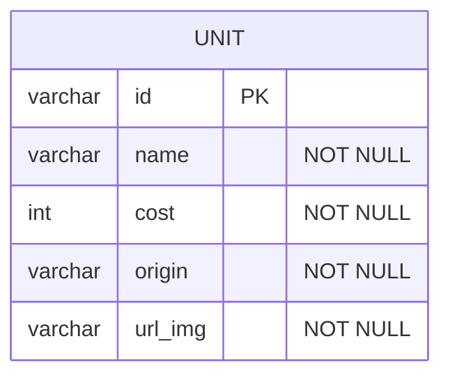
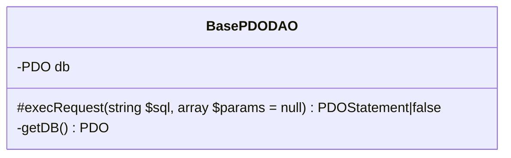
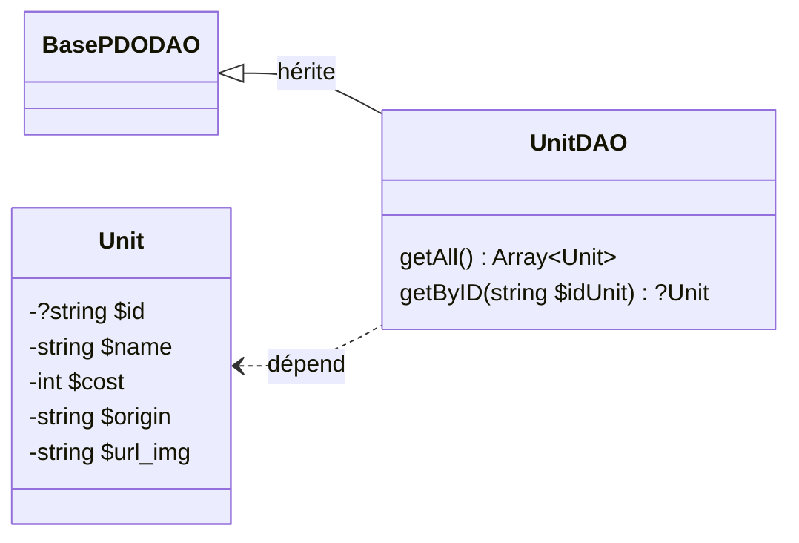

# Project TFT - Part 02 - Stocker et afficher les données

## 1 - Coté base de données

**1.1 :** Vous devriez avoir accès à une base de données MySQL (via grp ou bien XAMPP). Regardez la procédure pour accéder à votre outil PhPMyAdmin. Cela nous servira à administrer la base de données. (PhPMyAdmin n'est pas obligatoire, utiliser un autre moyen comme mysql-cli, Datagrip ou bien MySQLWorkbench peut très bien fonctionner). Connectez vous à votre SGBD et sélectionnez la bonne base de données. Nous sommes prêt à commencer !

**1.2 :** Nous allons, pour le moment, nous contenter d'une seule entité pour représenter nos unités. Nous allons donc créer une table qui suit ce schéma :



Je vous invite à bien utiliser UTF-8 (*utf8_general_ci* par exemple) pour éviter les soucis d'accents. De plus, veuillez à utiliser *InnoDB* comme moteur pour votre table. Nous pourrons en avoir besoin plus tard.

Essayez d'insérer une unité avec des données cohérentes que nous pourrons afficher plus tard sur notre page web. Les cost/rarity vont de 1 à 5

```text
Contrairement à d'habitude, l'ID est un varchar. Je vous invite à utiliser la fonction uniqid() de php pour les générer.
```

## 2 - Coté code

**2.0** Il est temps de repasser sur notre projet PHP. Dans un soucis de sécurité, il est temps de mettre en place le système qui stockera 
nos infos de connexion. 

Je vous propose d'essayer de remédier à ce problème en externalisant ces infos dans un autre fichier qui pourrait être une classe Config par exemple.

Celle-ci pourrait charger les informations à l'aide d'un fichier de configuration `.ini`.

Pour vous aiguiller, regarder la doc de la fonction `parse_ini_file`.

Voici un exemple de classe `Config` à mettre dans le dossier `📂Config`. Le fichier peut être modifier si besoin

```php
namespace Config;
use Exception;

class Config {
    private static $param;

    // Renvoie la valeur d'un paramètre de configuration
    public static function get($nom, $valeurParDefaut = null) {
        if (isset(self::getParameter()[$nom])) {
            $valeur = self::getParameter()[$nom];
        }
        else {
            $valeur = $valeurParDefaut;
        }
        return $valeur;
    }

    // Renvoie le tableau des paramètres en le chargeant au besoin
    private static function getParameter() {
        if (self::$param == null) {
            $cheminFichier = "Config/prod.ini";
            if (!file_exists($cheminFichier)) {
                $cheminFichier = "Config/dev.ini";
            }
            if (!file_exists($cheminFichier)) {
                throw new Exception("Aucun fichier de configuration trouvé");
            }
            else {
                self::$param = parse_ini_file($cheminFichier);
            }
        }
        return self::$param;
    }
}
```

Voici un exemple de fichier `dev.ini`

```ini
;config dev
[DB]
dsn = 'mysql:host=localhost;dbname=YOURDBNAME;charset=utf8';
user = 'YOUR_USERNAME';
pass = 'YOUR_PASSWORD';
```

Ainsi, vous n'aurez qu'à ajouter dans le fichier `.gitignore` votre `dev.ini` et mettre un `dev_sample.ini` avec des informations standard. 
L'utilisateur voulant utiliser votre projet n'aura qu'à mettre ses infos ici et renommer le fichier (très utile pour le partage ou le déploiement).

Comme les fonctions de Config sont static, vous pourrez récupérer une info avec le simple code suivant : 

```php
Config::get('NOM_VARIABLE_DANS_INI_FILE')
```

**2.1 :** Créez le fichier *models/BasePDODAO.php* suivant ce schéma :



Il vous faudra coder la fonction `getDB()` : cette fonction à pour but d'instancier un objet PDO avec les 
infos de connexion dans l'attribut `$db` si ce dernier est null.
Puis, elle retournera simplement l'attribut `$db`. N'hésitez à vous référer à votre cours et à la doc pour l'instance de PDO.
C'est ici que vous utiliserez `Config`.

Pour la fonction `execRequest`, celle-ci à pour objectif d'exécuter la requête `$sql` passée en paramètre. 
Elle pourra être préparée et exécutée avec les `$params` s'ils existent (👀 `$params` à une valeur par défaut). 
Notre fonction retournera le résultat de la fonction `execute` de __PDO__ (qui est un *PDOStatement*).

Un peu d'aide => Voici un exemple de paramètre que notre fonction pourrait recevoir :

```php
$sql = 'select * from T_COMMENTAIRE where BIL_ID=?';
$commentaires = $this->executerRequete($sql, array($idBillet));
```

**2.2 :** Il est temps de créer notre entité avec son manager ! Voici le diagramme de nos classes *models/Unit.php* et *models/UnitDAO.php*



Comme les attributs de la classe `Unit` sont privés. Vous ajouterez les `Getter` & `Setter` associés.

```text
Si vous voulez implémenter l'Hydratation dès maintenant, ne vous gênez pas ;)
Cela sera demandé plus tard dans tous les cas.
```

Il vous faudra implémenter les méthodes `getAll` et `getByID` de la classe `UnitDAO`. 
Elles ont pour vocation d'utiliser la méthode `execRequest` pour récupérer les données de la BD et les transformer 
soit en `array` d'`Unit` soit juste en une `Unit` (*getByID* ne pouvant retourner évidemment qu'une valeur sinon *null*).

**2.3 :** Maintenant que nous avons toutes nos armes pour récupérer la donnée, 
il faut que le contrôleur les récupèrent pour les envoyer à la vue et enfin les afficher o/

Pour tester que tout fonctionne, faite une instance du DAO dans la fonction `Index`. 
Sauvegarder dans 3 variables différentes le retour des fonctions `getAll()`, `getByID(idQuiExiste)` et `getByID(idQuiNexistePas)`.

Et pour finir passez les à votre vue `Index` générée et réalisez un `var_dump` de ces variables dans le fichier `home.php`.

Vous devriez avoir une liste de `Unit`, une `Unit`, et `null` si tout s'est déroulé correctement 
(dans un format d'affichage moche au possible ;) ).

```text
Pour que la vue accède à une $var, n'oubliez pas de lui passer dans la fonction render(["var" => "$var", ...])
```

Code `home.php`

```php
<?php var_dump($listUnit); ?>

<?php var_dump($first); ?>

<?php var_dump($other); ?>
```

Affichage Moche :


## 3 - Coté design

**3.1 :** Il est grand temps de rendre cet affichage un peu plus classe. Sur notre page *Index*, faite afficher les données de nos unités !

```text
Vous êtes libre d'utiliser une librairie pour le CSS ou de le coder vous-même. La structure en tableau n'est pas obligatoire,
si vous vous sentez de faire quelques chose de plus graphique, vous êtes libre (attention au temps tout de même)
```

**3.2 :** Nous allons préparer l'avenir. Pour cela, il faudra ajouter un endroit (div/colonne) qui accueillera des options
Nous pourrons alors pour chaque unité, ajouter un lien représenté soit par un texte, soit par une icône, soit par un bouton, etc... . 
Ces derniers permettront de modifier ou supprimer une unité !

### Exemple css design


### Exemple avec un tableau Materialize (Données non contractuelles)


Bien joué si vous êtes toujours en vie jusqu'ici :D
