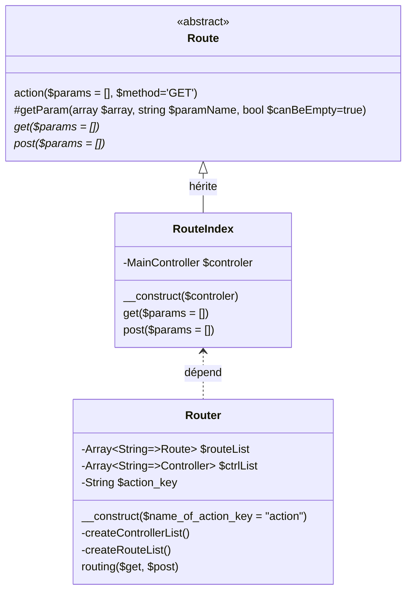
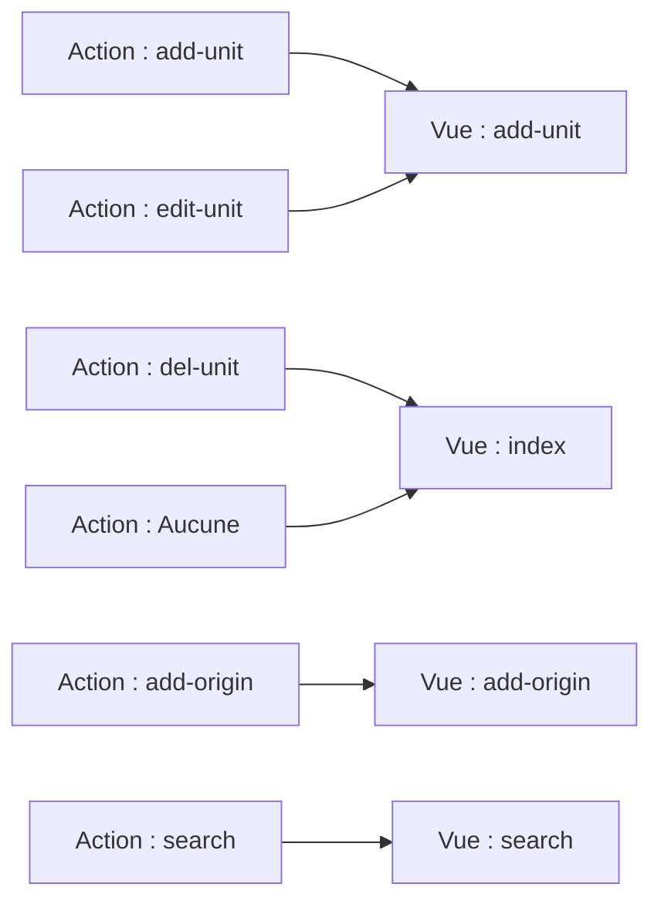

# Project TFT - Part 03 -  Naviguer entre les pages moussaillons

Nous affichons notre page d'accueil ! Mais nous sommes encore bien statique. Il est grand temps de pouvoir naviguer entre nos pages !

Petit point théorique : nous pourrions naviguer entre des pages PHP du style `index.php` puis `updateUnit.php`, etc, etc. Ce n'est pas vraiment le comportement que nous voudrions.

Voici le comportement voulu :

- Le fichier `index.php` instanciera notre routeur et celui-ci aura pour rôle de choisir la bonne route en passant les paramètres de l'url.
- Les routes auront comme rôle de gérer les paramètres ainsi que de choisir le contrôleur à appeler.
- Le routeur sera quant à lui, chargé de trouver la bonne route.

Par exemple : `index.php?action=updateUnit&id=5` signifie : on veut appeler l'action `updateUnit` avec comme info l'`id` valant 5 (qui nous permettrait de préremplir un formulaire).

## 1 - Ajouter des liens dans la page

**1.1 :** Vous allez devoir créer un menu avec des liens (vous avez peut-être déjà commencé dans la première partie). 
Ces liens feront tous référence à `index.php`. Ils seront accompagnés d'un paramètre que nous appellerons `action`.

```text
Votre menu devrait apparaitre sur toutes les pages.
```

Pour le moment, nous allons créer 4 liens :

- action = *add-unit*
- action = *add-unit-origin*
- action = *search*
- un lien vers *index* sans *action* pour retourner sur l'*index*

```text
Vous êtes libre du style CSS de votre menu,
mais celui-ci devrait avoir du sens
```

**1.2 :** Si vous vous souvenez, au TP7, vous avez ajouté une colonne avec des actions à côté de vos Unit.
Pour chaque ligne, vous ajouterez un lien (qui peut être un bouton, une icône, un texte, ...) avec les cibles suivantes :

- action = edit-unit & id = *l'id du unit*
- action = del-unit & id = *l'id du unit*

N'hésitez pas à regarder plus haut l'url que j'ai proposé en exemple pour l'écrire correctement.

Normalement, si tout est correct, vos liens ramènent tous sur la page actuelle. Seule l'url devrait changer.

## 2 - Afficher différentes pages suivant l'url

**2.1 :**  Notre objectif, pour commencer, sera de créer des pages ultra simples juste pour attester que le changement fonctionne. 
Pour cela, travaillons dans notre dossier `views`.

Créez les différents fichiers *PHP* qui correspondront aux vues suivantes :

- *add-unit* (*add-unit.php*)    
- *add-type-origin* (*add-origin.php*)
- *search*  (*search.php*)

Ces fichiers ne contiendront qu'une balise `<h1></h1>` qui exprime leur nom (ce qui nous permettra de vérifier que nous sommes sur la bonne page).

**2.2 :** Il est temps de nous attaquer à l'aiguillage qui indiquera quel fichier générer, le routeur !

Pour cela, nous allons aménager notre dossier `Contrôleur`. Dans celui-ci, créez un dossier `Router`. Dans ce dernier, créez un dossier `Route`.

- Dans le dossier `Route`, nous aurons toutes nos classes `Routes` (ex : *RouteIndex.php*).
- Dans le dossier `Router`, nous aurons la classe `Route.php` et la classe `Router.php`.

Voici le diagramme de classe de notre routeur (attention aux méthodes abstraites):



Pour la classe *Route* :

- Le constructeur initialise les attributs.
- La méthode action ne fait qu'appeler la méthode voulue `get` ou `post` en fonction du paramètre `method`.
- Récupérer et étudier `getParams` (libre à vous de l'améliorer).

```php
    protected function getParam(array $array, string $paramName, bool $canBeEmpty=true)
    {
        if (isset($array[$paramName])) {
            if(!$canBeEmpty && empty($array[$paramName]))
                throw new Exception("Paramètre '$paramName' vide");
            return $array[$paramName];
        } else
            throw new Exception("Paramètre '$paramName' absent");
    }
```

Pour la classe RouteIndex :

- Le constructeur appelle celui du *parent* et initialise la valeur du *controller*.
- La méthode *get* ne fait qu'appeler la méthode *index* du *controller*.
- la méthode *post* ne fait rien ou alors appelle la méthode *index* du *controller*.

Pour la classe Routeur :

- Le constructeur fait appel à `createControllerList` et `createRouteList`.
- `createControllerList()` va créer la liste clé/valeur des `controllers` ex : `["main" => new MainController()]`.
- `createRouteList()` va créer la liste clé/valeur des routes ex : `["index" => new RouteIndex("", $this->ctrlList["main"])]`.
- `routing()` va déterminer la route en fonction des informations dans `$_GET/$_POST`, puis va appeler la méthode `action` de la route.

Pour le moment, le *routing* ne fera qu'appel à la route *index*.


**2.3 :** Il est temps d'ajouter un routage complet ! Prenons `add-unit` par exemple.
Nous pouvons avoir un `UnitController` qui gère tout ce qui traite des unit directement.

Créez donc une fonction `displayAddUnit()` dans le contrôleur. Celle-ci n'aura pour but que d'afficher notre page `add-unit`.
N'hésitez pas à regarder comment générer la `View` dans la fonction `Index` de `MainController`.

Ajoutez votre controller à la liste des `controllers` dans votre `Router`.

Il est temps de créer une nouvelle `Route` nommée `RouteAddUnit`. Cela implique de créer la classe, puis de l'ajouter dans la liste des routes du `router`.

La méthode `get` de notre route ne fera qu'appeler `displayAddUnit()` du `controller`. 

```text
    Vu que la classe Route oblige à implémenter les fonctions get et post, je vous invite à laisser la methode post() vide. Celle-ci sera utilisable plus tard.
```

Puis pour terminer, dans la fonction `routing`, vérifier le contenu de votre variable `$get`. Si celle-ci contient la clé `action`,
récupérez la route liée à cette clé pour invoquer sa méthode `action()`. 
Attention, si le paramètre `$post` n'est pas vide, l'appel à action sera avec `'POST'` et ses données seront dans `$post`.

Si vous cliquez sur votre lien d'ajout de unit, cela devrait changer de page !

**2.4 :** Nous arrivons à nos fins ! Il est temps de faire la même chose pour les différentes pages.
`Search` devrait utiliser le `MainController` vu qu'elle est générique. `AddOrigin` pourrait aller dans `UnitController` ou avoir le sien.

Rappel des étapes : 

- Créer le controller / ajouter une méthode dans l'existant si necéssaire 
- Créer la classe RouteQQchose correspondante
- Compléter les méthodes get/post
- Ajouter les informations dans le router (routeList et ctrlList)

Si tout s'est bien passé, vous devriez pouvoir naviguer dans votre site (n'oubliez pas d'avoir un moyen de revenir à l'index dans votre gabarit !!)

**2.5 :** Vous avez peut-être remarqué, mais il y a des actions qui n'ont pas de pages. Celles-ci ont pour vocation une action
(supprimer une unité par exemple) puis de rediriger vers une page (exemple : l'`index`). 
Il nous reste donc à gérer les actions `update` et `delete`.

Pour le moment, `Delete` ne fera que rediriger vers l'accueil. Petite différence cependant, quand la vue sera générée, elle prendra un paramètre en plus dans son `Array` de variable.
Celle-ci s'appellerait message et contiendrait un texte qui confirme la suppression.

Pour `Update`, elle redirigera sur la page d'ajout unit. Elle aura juste accès (en *méta-données* `GET`) à l'`ID` de l'unit,
ce qui permettra plus tard de faire la différence entre ajout & update dans le formulaire.

Ce schéma résume la correspondance entre nos actions et nos vues




## 3 - Construire nos pages

**3.1 :** Attaquons notre page d'ajout d'unit ! Celle-ci devrait contenir juste un formulaire nous 
permettant de créer un unit en base de données. A vous de jouer ! (Evidemment, à ce stade, le formulaire ne fera rien !).

```text
Comme toujours, un peu de CSS serait appréciable 
(Qui a dit évaluable :o ?)
```

**3.2 :** La page d'ajout de l'origin est très similaire à celle d'une unit. Un simple formulaire. 
Mais comme nous n'avons pas encore défini de modèle, 2 simples champs texte pour son nom et son image suffira ;).

**3.3 :** Il nous reste la page de recherche. Celle-ci sera composé d'un champ texte et d'un select qui 
permettra de choisir le champ sur lequel on fait la recherche. 
Le plus optimal serait d'avoir les options de ce select qui dépendent directement des propriétés de notre classe `Unit`. 
Comme cela, en cas de changement, nous n'aurions pas à changer notre code.

Si vous avez besoin d'un peu d'aide, voici un moyen d'obtenir les propriétés d'une classe => [Manuel](https://www.php.net/manual/en/reflectionclass.getproperties.php)

```text
Ne focalisez pas tout votre temps dessus. Si cela vous paraît trop compliqué, mettez les 
champs en dur pour le moment et revenez-y s'il vous reste du temps à la fin.
```

**3.4 :** Pour finir, petit nettoyage des `var_dump` qui traineraient sur votre site. 
Puis n'hésitez pas à travailler un peu le design de vos pages/formulaires.

## 4 - Conclusion & Bonus

Nous devrions maintenant pouvoir naviguer entre toutes les pages de notre site. Afficher les différents formulaires 
(qui ne font rien). L'objectif du prochain TP sera justement de mettre en place le CRUD (`Create Read Update Delete`) 
de notre unit !

**Bonus :** Actuellement, si une exception se produit, nous avons une page moche. 
Il faut donc gérer pour que si une exception se produit,
nous affichions une page d'erreur 
