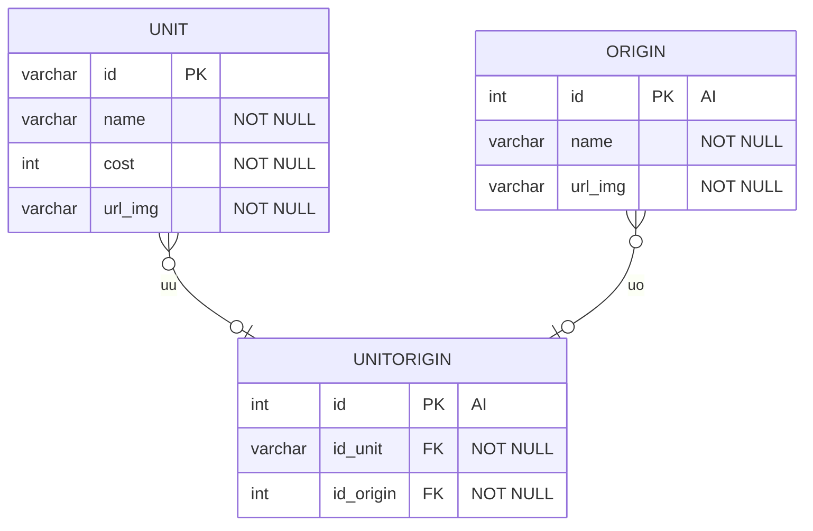
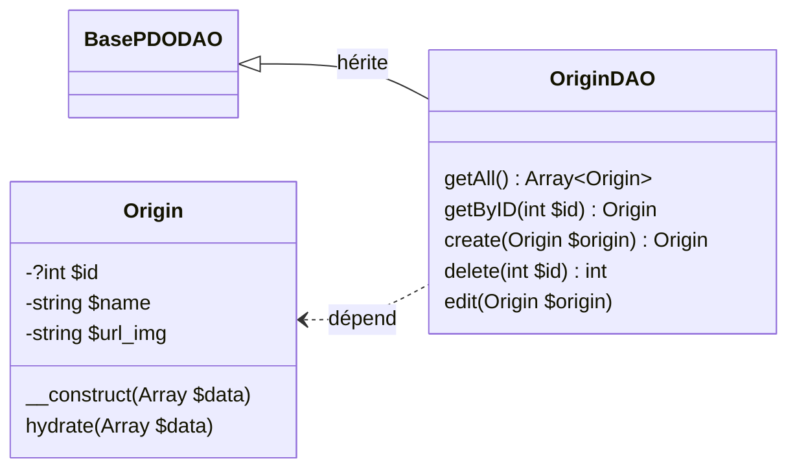

# Project TFT - Part 05 - Aux origines multiples !

A ce stade, vous devriez avoir le CRUD de votre unité complètement fonctionnel. Il est temps de corser un peu le jeu pour le rendre plus réaliste !

Il faut savoir qu'une unité ne possède n'ont pas qu'une origine mais 2 voir 3 dans le vrai jeu 
(et il fait une différence entre classe et origine, mais nous allons considérer que c'est la même chose pour ce sujet).

Dans un autre soucis de facilité, pour le moment, au lieu de considérer 2 ou 3 origines, nous allons considérer 0-3 origines.

## 1 - Une origine en base de données

**1.1 :** Deux visions sont possibles. Une relation *Many-To-Many* classique, ou bien une triple relation *One-to-Many*.
Nous allons modifier notre BD pour nous aligner sur ce nouveau schéma, le *Many-To-Many*.



Si vous avez des unités en BD, je vous recommande de réinitialiser vos données. Vous pouvez faire la liaison entre les 2 tables via SQL ou votre logiciel pour visualiser votre BD.

Avec la nouvelle contrainte entre Unit et Unitorigin, n'oubliez pas le ON DELETE/UPDATE CASCADE si vous voulez toujours pouvoir supprimer.

```text
A ce stade, vous devriez avoir tout cassé, c'est normal, pas de panique. C'est pour ca que je vous recommande de ne plus avoir de donnée en base
Normal vu que vous avez du supprimer un champs
Nous verrons pour corriger cela dans la 2ème partie
```

**1.2 :** Maintenant que nous avons une table *UNITORIGIN*, il est temps de le refléter dans notre code. Et surtout faire fonctionner notre formulaire d'ajout.

Pour commencer, attaquons notre modèle. Il ressemblera beaucoup à *Unit* mais avec moins d'attribut.



```text
La présence de l'hydratation est requise. Attention pour url_img ;)
```

**1.3 :** Maintenant, il faut mettre en oeuvre la fonction qui permet de créer une *Origin* via le formulaire. Il faut alors :

1. Mettre à jour l'action du formulaire
2. Gérer l'action dans le routeur
3. Créer et appeler la bonne fonction du controller
4. Cette dernière crée le type et affiche l'index avec un message

Vous devriez avoir l'habitude maintenant. A vous de jouer pour faire fonctionner l'ajout d'une origine.

L'application n'est pas forcément prévus pour modifier et supprimer une origine. Mais vous êtes libre de l'implémenter.

## 2 - Liaison

**2.1 :** Maintenant que nous avons des origines. Il faut les lier à une unité. Pour cela, quelques modifications sont nécessaires.

Pour commencer, on va considérer que notre unité possède une liste d'origine. Il faut donc modifier le type de l'attribut origin dans notre classe *Unit*.

N'oubliez pas de modifier le typage dans les getters/setters

```text
Pour vous faciliter la vie, le null safe operator ?-> au lieu de -> 
permet d'appeler une fonction seulement si l'objet n'est pas null
```

A ce stade, nous avons un soucis. Pour hydrater une unité, actuellement, le *setter* attend un array. Hors la BD ne nous retourne plus aucune origine.

Il faut donc ajouter une requête en plus pour récupérer les origines de l'unité dans notre OriginDAO.

```php
public function getOriginsForUnit(string $unitId) : array {}
```

Une fois que vous avez fait cela, il faudra modifier tous les endroits où vous créez vos unités, 
en ajoutant l'appel a cette fonction pour récupérer votre liste d'origins.

```text
Petite invitation à la réflexion de qualité de code. Si vous avez eu le réflexe de faire un pattern comme la fabrique, 
alors cette modification devrait être simple et très localisé o/
```

Et pour finir, il faudra certainement modifier votre affichage sur la page d'accueil, pour gérer le getter d'origin comme un array et non une string.

Si tout est bon, vous devriez pouvoir ajouter à la main dans la BD des unités, et les lier avec des origines. La page d'accueil devrait fonctionner.


**2.2 :** Attaquons-nous à l'ajout d'une unité. Une modification dans le formulaire s'impose. Avez-vous anticipé laquelle ? 

...

Récupérons la liste des origines depuis notre DAO, puis améliorons le formulaire pour avoir l'*id* en valeur et le nom en visuel.

Pour rappel, il peut y avoir jusqu'à 3 origines, donc il nous faudra 3 *select*

Voici un exemple :

```html
<option value="1">Mage</option>
<option value="2">Sugarcraft</option>
```

Il faut maintenant modifier la fonction post de notre route *add-unit*. Toujours une seule clé pour les origines mais cela doit être un array d'array avec comme seule clé id .

Exemple : 

```php
...
"origin" =>[
  ["id"=>intval(parent::getParam($params, "name-of-select", false))],
  ...
]
...
```

Il restera à modifier l'insertion en BD pour aussi insérer des unitorigins

Si tout se déroule comme prévu, vous pouvez de nouveau ajouter une unité mais cette fois-ci, lié à une origine.

**2.3 :** Finalisons ceci en corrigeant l'update.

Comme pour l'ajout, il vous faudra mettre à jour : 

- Le controler avec la fonction *displayEdit*
- Le formulaire de la vue si vous avez 2 fichiers différents
- La route *post* *EditUnit* comme la route *AddUnit*
- Modifier la fonction *update* du *DAO*

La modification du DAO vous demandera un peu de réflexion. Comment savoir quelle origine est modifié par exemple ? 
Il faut aussi faire attention de ne pas avoir 2 fois la même origine.

A vous de trouver une solution o/ Si vous galérez, n'hésitez pas à passer à la suite et revenir ici à la fin

## 3 - Seek and Destr... Only Seek

**3.1 :** Voici le dernier point manquant aux fonctionnalités attendues ! L'objectif sera de réaliser la fonctionnalité avec votre savoir (et pourquoi pas un peu d'aide du prof !).

Pour vous aiguiller, vous aurez les Behavior Test Description!

Voici celui qui doit être DEJA fait !

```text
Étant donné : Qu'un utilisateur veut faire une recherche
Quand : Il clique sur le bouton recherche
Alors : Le formulaire de recherche s'affiche ! 
```

Et voici ceux qui restent pour vous aider.

```text
Étant donné : Qu'un utilisateur tape un mot et le champs nom
Quand : Il clique sur le bouton rechercher
Alors : La page affiche un tableau des résultats
Et : Ce dernier possède les boutons d'action Edit/Delete
```

```text
Étant donné : Qu'un utilisateur tape un mot et le champs origine
Quand : Il clique sur le bouton rechercher
Alors : La page affiche un tableau des résultats avec l'image de l'origine
Et : Ce dernier possède les boutons d'action Edit/Delete
```

```text
Étant donné : Qu'un utilisateur tape une donnée de type incorrect (int pour id par exemple)
Quand : Il clique sur le bouton rechercher
Alors : La page affiche un message d'erreur
```

```text
Étant donné : Qu'un utilisateur n'as rien écrit dans l'input
Quand : Il clique sur le bouton rechercher
Alors : Le formulaire doit répondre que le champs data est obligatoire
```

```text
Étant donné : Qu'un utilisateur ne spécifie pas de champs sur lequel chercher
Quand : Il clique sur le bouton rechercher
Alors : La page affiche un message d'erreur
```

Et voilà, vous avec carte blanche pour réaliser la fonctionnalité ! Bon courage !

Une fois cela fini nous arrivons presque au terme de notre projet ! 

- [x] Afficher la liste des unités
- [x] Ajouter des unités à la BD
- [x] Editer une unité
- [x] Supprimer une unité
- [x] Rechercher une unité particulier
- [x] Affecter des origines à une unité
- [x] Avoir un design simple et fonctionnel
- [ ] Plein de bonus

Pour les bonus ! Il nous restera un dernier TP !

## 4 - Bonus de fin

Nous avons déjà discuté d'idées d'améliorations durant ce TP, c'est le bon moment pour les travailler !

Mais je peux vous en proposer un autre. Nous allons revoir et modifier notre dernier *Behavior* pour le rendre plus fluide.

```text
Étant donné : Qu'un utilisateur ne spécifie pas de champs sur lequel chercher
Quand : Il clique sur le bouton rechercher
Alors : La page affiche un tableau de résultat. Chaque champ qui a permis d'identifier la ligne devra être mis en surbrillance par le CSS
```

Bon courage ;)
